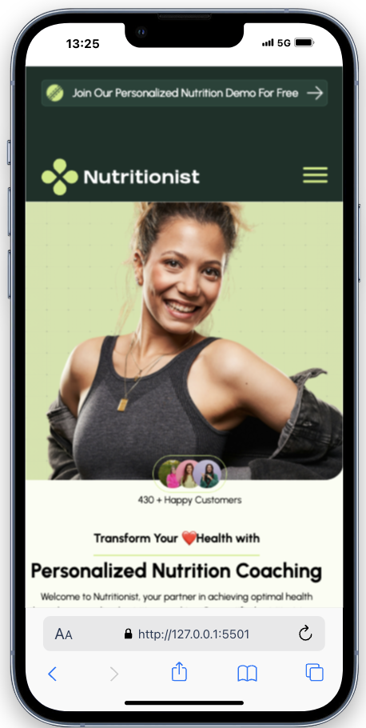
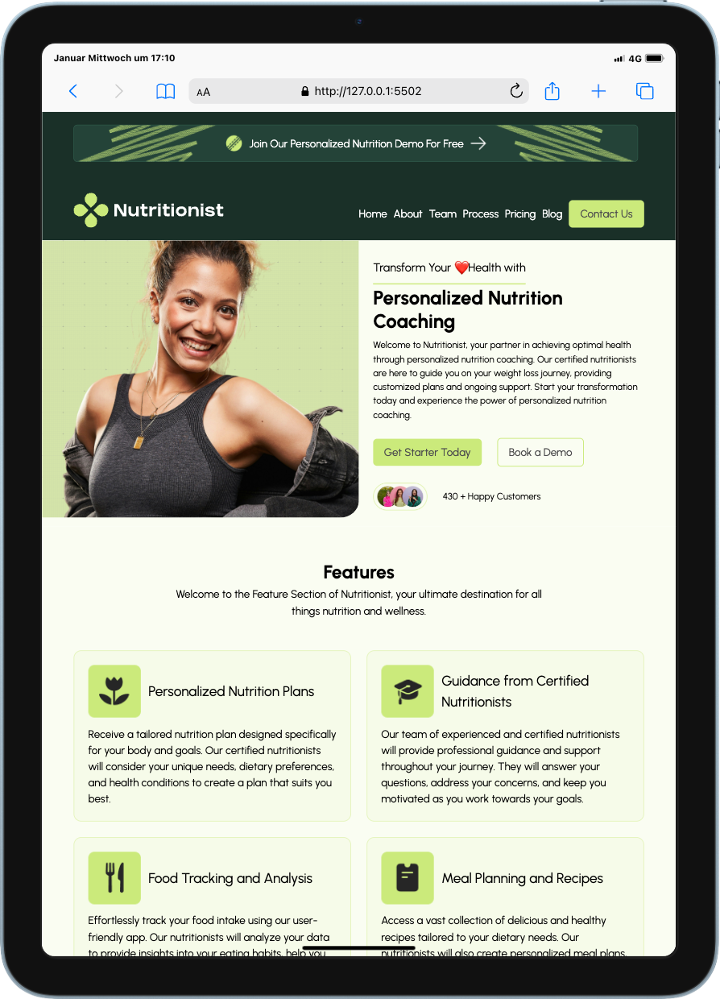
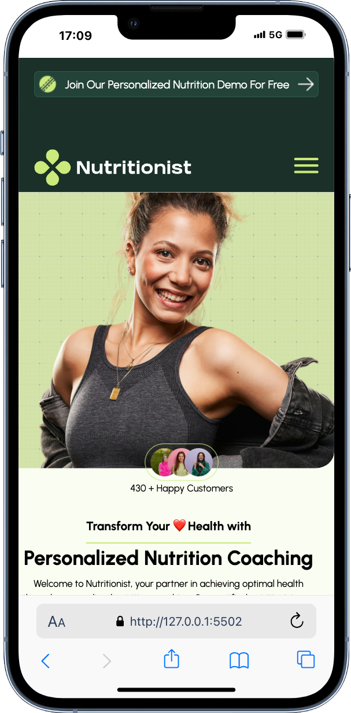

<!-- Ueberschrift -->

# Abschlussprojekt Modul 1 Health App

<!-- Ein visuelles Element, das das Projekt repräsentiert. Dies könnte ein Screenshot, ein Logo oder eine Folie aus einer Projektpräsentation sein. Es dient dazu, den Leser visuell anzusprechen und einen ersten Eindruck vom Projekt zu vermitteln. -->
<div style="display: flex; justify-content: center;">
  
</div>
<br/>

<!-- Eine kurze Einführung, die das Projekt vorstellt. Diese sollte die Entstehungsgeschichte, die Motivation hinter dem Projekt und die im Projekt angewandten Fähigkeiten oder Technologien hervorheben. Ziel ist es, das Interesse der Leser zu wecken und sie neugierig auf das Projekt zu machen. -->
<p>Personalized Nutrition Coaching is a project born out of my passion for web development and a testament to my growth during my 6-month Web Development Bootcamp. Developed on day 28 of my Bootcamp, this project showcases the skills and knowledge I've acquired so far.<br/>
I'm very proud of this project, which highlights my ability to create responsive designs using media queries. Dive in and explore the beauty of "Personalized Nutrition Coaching" – a reflection of my journey and dedication to becoming a great web developer. </p>

## Table of Contents 📑

<!-- Inhaltsverzeichnis -->
<!-- Ein Inhaltsverzeichnis, das den Lesern hilft, sich schnell in der README-Datei zu orientieren und die gewünschten Informationen zu finden. -->

<!-- basic FRONTEND -->

- [About](#about)
- [Tech Stack](#tech-stack)
- [Getting Started](#getting-started)
  - [Prequisites](#prequisites)
  - [Installation](#installation)
  <!-- - [Usage](#usage) -->
- [Design](#design)
- [Deployment](#deployment)
<!-- - [Contributors](#contributors) -->

<!-- BACKEND -->
<!-- - [Demo](#demo)
- [Features](#features)
- [Tech Stack](#tech-stack)
- [Getting Started](#getting-started)
- [Installation](#installation)
- [Usage](#usage)
- [API Integration](#api-integration)
- [Database](#database)
- [Authentication](#authentication)
- [Backend Routes](#backend-routes)
- [Design](#design)
- [Deployment](#deployment)
- [Third-Party Libraries & Tools](#third-party-libraries--tools)
- [Contributors](#contributors) -->

<!-- ODER zb so (ausklappbar): -->
<!-- <details>
  <summary>Table of Contents</summary>
  <ol>
    <li>
      <a href="#about-the-project">About The Project</a>
      <ul>
        <li><a href="#built-with">Built With</a></li>
      </ul>
    </li>
    <li>
      <a href="#getting-started">Getting Started</a>
      <ul>
        <li><a href="#prerequisites">Prerequisites</a></li>
        <li><a href="#installation">Installation</a></li>
      </ul>
    </li>
    <li><a href="#usage">Usage</a></li>
    <li><a href="#roadmap">Roadmap</a></li>
    <li><a href="#contributing">Contributing</a></li>
    <li><a href="#license">License</a></li>
    <li><a href="#contact">Contact</a></li>
    <li><a href="#acknowledgments">Acknowledgments</a></li>
  </ol>
</details> -->

## About

<!-- Ein Abschnitt, der detaillierte Informationen über das Projekt liefert. Hier koennte der Zweck des Projekts, die verwendeten Technologien und der Entwicklungsprozess beschrieben werden. Dies gibt den Lesern einen tieferen Einblick in das Projekt. -->

This project is a part of a Fullstack Bootcamp. It was developed over the course of a two days and was implemented solely by me. Using Visual Studio Code, I built this project with HTML and CSS. I also used Javascript for the Calculation of your Daily Calorie Requirement depending if you are male or female.

The aim of this project was to practice the concepts learned in the first module of the Bootcamp, specifically HTML and CSS. The result is a flexible and responsive website that could serve as a platform to get personalized nutrition coaching in order to help optimize your health. It features a navigation menu that adapts to screen size, transforming into a burger menu on smaller screens. Additionally, it includes a calculator that will show your daily calorie requirement depending on your gender, age, body size, weight and level of activity.

<!-- hier bieten sich Screenshots des Projekts an, um auf verschiedenen Geräten, die Reaktionsfähigkeit und das Design des Projekts zu demonstrieren. -->
<div style="display: flex; justify-content: space-between; align-items: center; width: 100%">
    
    
</div>

## Tech Stack

<!-- Ein Abschnitt, der die im Projekt verwendeten Technologien auflistet. Dies gibt den Lesern einen Überblick über die Werkzeuge und Frameworks, die für die Entwicklung des Projekts verwendet wurden. -->

<!-- hier eine Website mit Badges, die du verwenden koenntest: ⬇️ -->
<!-- https://github.com/alexandresanlim/Badges4-README.md-Profile -->

**Markup:**  
  
**Styling:**  

<!--    -->
**IDE:**  
  
**JS:**

**Version Control:**  
  
<!-- **Project Management:**  
   -->
**Design:**  


## Getting Startet

<!-- Ein Abschnitt, der den Lesern erklärt, wie sie das Projekt auf ihrem eigenen Computer einrichten und ausführen können. -->

Follow these simple steps to set up and run the "Back to Nature" project on your local machine.

### Prequisites

<!-- Eine Liste der Voraussetzungen, die erfüllt sein müssen, bevor das Projekt installiert und ausgeführt werden kann. Dies könnte die Installation von Software wie Node.js, Git oder andere Abhängigkeiten beinhalten. -->

Before you begin, ensure you have the following installed:

- [Git](https://git-scm.com/)
- [VS Code](https://code.visualstudio.com/download)
- [Live Server Extention for VS Code](https://marketplace.visualstudio.com/items?itemName=ritwickdey.LiveServer)

<!-- Backend -->
<!-- zB: - [Node.js](https://nodejs.org/) (includes npm) -->

### Installation

<!-- Schritt-für-Schritt-Anweisungen zur Installation und Einrichtung des Projekts. Diese sollten klar und einfach zu befolgen sein, um sicherzustellen, dass auch weniger erfahrene Benutzer das Projekt erfolgreich starten können. -->

1. **Clone the repository:**
   ```bash
   git clone https://github.com/yourusername/back-to-nature.git
   ```

### Running the Project

<!-- Anweisungen, wie das Projekt ausgeführt wird, nachdem es installiert wurde. Dies könnte das Starten eines lokalen Servers oder das Öffnen einer HTML-Datei in einem Webbrowser beinhalten. Bei Backend Projekten wird natuerlich noch mehr benoetigt. -->

2. **Open the project and click to Go Live from the status bar to turn the server on**
   

**You're all set! Explore the "Back to Nature" project and enjoy the journey.**

## Design

<!-- Ein Abschnitt, der den Designprozess und die Werkzeuge beschreibt, die für das Design des Projekts verwendet wurden. Dies könnte auch eine Erklärung enthalten, wie das Design in den Entwicklungsprozess integriert wurde. -->

The design for "Personalized Nutrition Coaching" was provided as part of the Bootcamp and created using Figma. This design served as a blueprint to guide the development of the project, ensuring a cohesive and visually appealing user experience.

<!-- fuer Fullstack Projekte geht es weiter mit: -->
<!--
## Usage
## API Integration
## Database
## Authentication
## Backend Routes
## Third-Party Libraries & Tools]
-->
## Deployment

<!-- Ein Abschnitt, der beschreibt, wie das Projekt bereitgestellt wurde. Dies könnte die Plattformen und Dienste umfassen, die zur Bereitstellung des Projekts verwendet wurden. -->
0 commit comments
Comments
