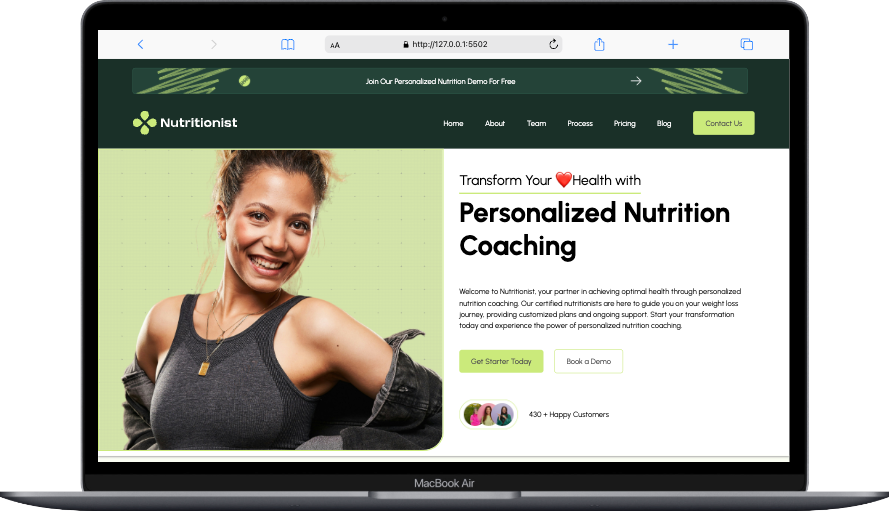

<!-- Ueberschrift -->

# Abschlussprojekt Modul 1 Health App

<!-- Ein visuelles Element, das das Projekt repräsentiert. Dies könnte ein Screenshot, ein Logo oder eine Folie aus einer Projektpräsentation sein. Es dient dazu, den Leser visuell anzusprechen und einen ersten Eindruck vom Projekt zu vermitteln. -->
<div style="display: flex; justify-content: center;">
  
</div>
<br/>

<!-- Eine kurze Einführung, die das Projekt vorstellt. Diese sollte die Entstehungsgeschichte, die Motivation hinter dem Projekt und die im Projekt angewandten Fähigkeiten oder Technologien hervorheben. Ziel ist es, das Interesse der Leser zu wecken und sie neugierig auf das Projekt zu machen. -->
Das Projekt "Personalized Nutrition Coaching" wurde im Rahmen des Abschlussprojekts des "HTML und CSS"-Moduls des sechsmonatigen Web Development Bootcamps entwickelt. Es entstand an Tag 28 des Bootcamps als mein erstes umfangreiches Projekt und demonstriert meine Fähigkeit, Designvorgaben responsiv für verschiedene Bildschirmgrößen umzusetzen.

Ein weiterer zentraler Bestandteil des Projekts ist ein interaktiver Abschnitt, der es den Nutzer*innen ermöglicht, ihren persönlichen täglichen Kalorienbedarf zu berechnen.

Dieses Projekt stellt einen ersten Schritt auf meinem Weg in die Welt des Web Developments dar und verdeutlicht meine bis dahin erworbenen praktischen Kenntnisse in der Webgestaltung und -entwicklung.


## Table of Contents 

<!-- Inhaltsverzeichnis -->
<!-- Ein Inhaltsverzeichnis, das den Lesern hilft, sich schnell in der README-Datei zu orientieren und die gewünschten Informationen zu finden. -->

<!-- basic FRONTEND -->

- [Über das Projekt](#über-das-projekt)
- [Tech Stack](#tech-stack)
- [Getting Started](#getting-started)
  - [Voraussetzungen](#voraussetzungen)
  - [Installation](#installation)
  <!-- - [Usage](#usage) -->
- [Design](#design)
- [Deployment](#deployment)
<!-- - [Contributors](#contributors) -->

<!-- BACKEND -->
<!-- - [Demo](#demo)
- [Features](#features)
- [Tech Stack](#tech-stack)
- [Getting Started](#getting-started)
- [Installation](#installation)
- [Usage](#usage)
- [API Integration](#api-integration)
- [Database](#database)
- [Authentication](#authentication)
- [Backend Routes](#backend-routes)
- [Design](#design)
- [Deployment](#deployment)
- [Third-Party Libraries & Tools](#third-party-libraries--tools)
- [Contributors](#contributors) -->

<!-- ODER zb so (ausklappbar): -->
<!-- <details>
  <summary>Table of Contents</summary>
  <ol>
    <li>
      <a href="#about-the-project">About The Project</a>
      <ul>
        <li><a href="#built-with">Built With</a></li>
      </ul>
    </li>
    <li>
      <a href="#getting-started">Getting Started</a>
      <ul>
        <li><a href="#prerequisites">Prerequisites</a></li>
        <li><a href="#installation">Installation</a></li>
      </ul>
    </li>
    <li><a href="#usage">Usage</a></li>
    <li><a href="#roadmap">Roadmap</a></li>
    <li><a href="#contributing">Contributing</a></li>
    <li><a href="#license">License</a></li>
    <li><a href="#contact">Contact</a></li>
    <li><a href="#acknowledgments">Acknowledgments</a></li>
  </ol>
</details> -->

## Über das Projekt

<!-- Ein Abschnitt, der detaillierte Informationen über das Projekt liefert. Hier koennte der Zweck des Projekts, die verwendeten Technologien und der Entwicklungsprozess beschrieben werden. Dies gibt den Lesern einen tieferen Einblick in das Projekt. -->
Dieses Projekt ist Bestandteil eines Web-Development-Kurses und wurde innerhalb von zwei Tagen eigenständig realisiert. Für die Entwicklung habe ich mit Visual Studio Code gearbeitet und die Website mit HTML und CSS erstellt. Die Berechnung des täglichen Kalorienverbrauchs, abhängig vom Geschlecht (männlich oder weiblich), wurde mithilfe von JavaScript umgesetzt.

Das Hauptziel des Projekts war es, die im ersten Modul des Bootcamps erlernten Konzepte, insbesondere HTML und CSS, praktisch anzuwenden. Das Ergebnis ist eine flexible und responsive Website, die als Plattform für die Interaktion mit Ernährungs-Coaches dienen könnte, um deren Angebote zu präsentieren und Buchungen zu ermöglichen.

Zu den zentralen Merkmalen der Website gehört eine responsive Navigationsleiste, die sich je nach Bildschirmgröße anpasst und in ein sogenanntes „Burger-Menü“ übergeht. Ein weiteres Highlight stellt die Kalorienberechnung dar, die ich nach nur wenigen Tagen JavaScript-Kursinhalten entwickelt habe.


<!-- hier bieten sich Screenshots des Projekts an, um auf verschiedenen Geräten, die Reaktionsfähigkeit und das Design des Projekts zu demonstrieren. -->
<div style="display: flex; justify-content: space-between; align-items: center; width: 100%">
    
    
    
</div>

## Tech Stack

<!-- Ein Abschnitt, der die im Projekt verwendeten Technologien auflistet. Dies gibt den Lesern einen Überblick über die Werkzeuge und Frameworks, die für die Entwicklung des Projekts verwendet wurden. -->

<!-- hier eine Website mit Badges, die du verwenden koenntest: ⬇️ -->
<!-- https://github.com/alexandresanlim/Badges4-README.md-Profile -->

**Markup:**  
  

**Styling:**  


**IDE:**  
  

**JS:**<br/>


**Version Control:**  
  
<!-- **Project Management:**  
   -->
**Design:**  


## Getting Startet

<!-- Ein Abschnitt, der den Lesern erklärt, wie sie das Projekt auf ihrem eigenen Computer einrichten und ausführen können. -->

Hier ist eine Anleitung, wie du das "Personalized Nutrition Coaching"-Projekt auf deinem lokalen Rechner einrichtest und ausführst:

### Voraussetzungen

<!-- Eine Liste der Voraussetzungen, die erfüllt sein müssen, bevor das Projekt installiert und ausgeführt werden kann. Dies könnte die Installation von Software wie Node.js, Git oder andere Abhängigkeiten beinhalten. -->

Folgende Programme solltest du installiert haben:

- [Git](https://git-scm.com/)
- [VS Code](https://code.visualstudio.com/download)
- [Live Server Erweiterung für VS Code](https://marketplace.visualstudio.com/items?itemName=ritwickdey.LiveServer)

<!-- Backend -->
<!-- zB: - [Node.js](https://nodejs.org/) (includes npm) -->

### Installation

<!-- Schritt-für-Schritt-Anweisungen zur Installation und Einrichtung des Projekts. Diese sollten klar und einfach zu befolgen sein, um sicherzustellen, dass auch weniger erfahrene Benutzer das Projekt erfolgreich starten können. -->

1. **Clone das Repository:**
   ```bash
   git clone https://github.com/YvonneJL/Personalized_Nutrition_Coaching
   ```

### Ausführen des Projekts

<!-- Anweisungen, wie das Projekt ausgeführt wird, nachdem es installiert wurde. Dies könnte das Starten eines lokalen Servers oder das Öffnen einer HTML-Datei in einem Webbrowser beinhalten. Bei Backend Projekten wird natuerlich noch mehr benoetigt. -->

2. **Öffne das Projekt und klicke auf "Go Live" in der Statusleiste unten rechts, um den Server anzuschalten**
   

**Alles ist eingerichtet! Nun kannst du das "Personalized Nutrition Coaching"-Projekt erkunden.

## Design

<!-- Ein Abschnitt, der den Designprozess und die Werkzeuge beschreibt, die für das Design des Projekts verwendet wurden. Dies könnte auch eine Erklärung enthalten, wie das Design in den Entwicklungsprozess integriert wurde. -->

Das Design für „Personalized Nutrition Coaching“ wurde im Rahmen des Bootcamps bereitgestellt und mit Figma erstellt. Dieses Design diente als Vorlage, um die Entwicklung des Projekts zu leiten und eine konsistente sowie visuell ansprechende Benutzererfahrung sicherzustellen.

<!-- fuer Fullstack Projekte geht es weiter mit: -->
<!--
## Usage
## API Integration
## Database
## Authentication
## Backend Routes
## Third-Party Libraries & Tools]
-->


<!-- Ein Abschnitt, der beschreibt, wie das Projekt bereitgestellt wurde. Dies könnte die Plattformen und Dienste umfassen, die zur Bereitstellung des Projekts verwendet wurden. -->

## Deployment

Über diesen Link, kommst du direkt zur Webseite.
- [Projekt "Personalized Nutrition Coaching"](https://personalized-nutrition-coaching.vercel.app/)
